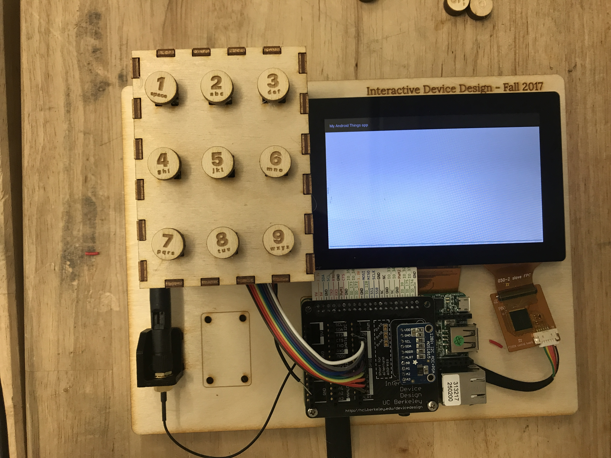
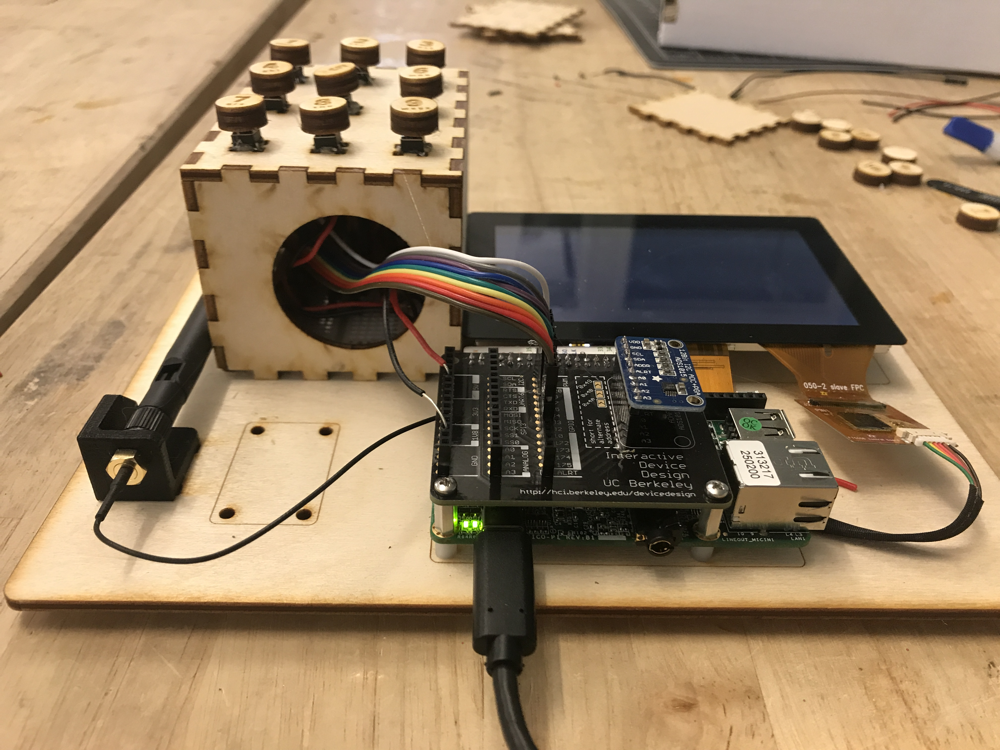
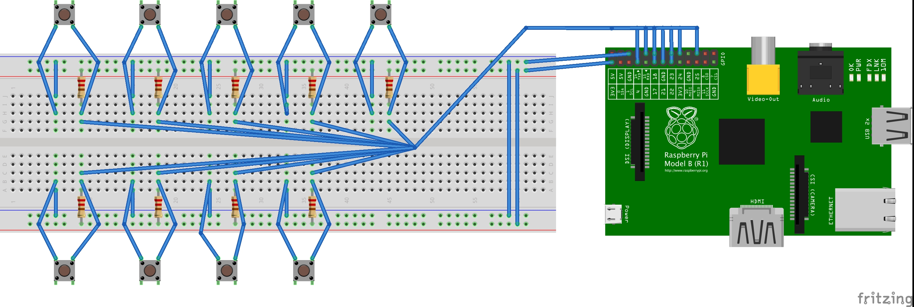
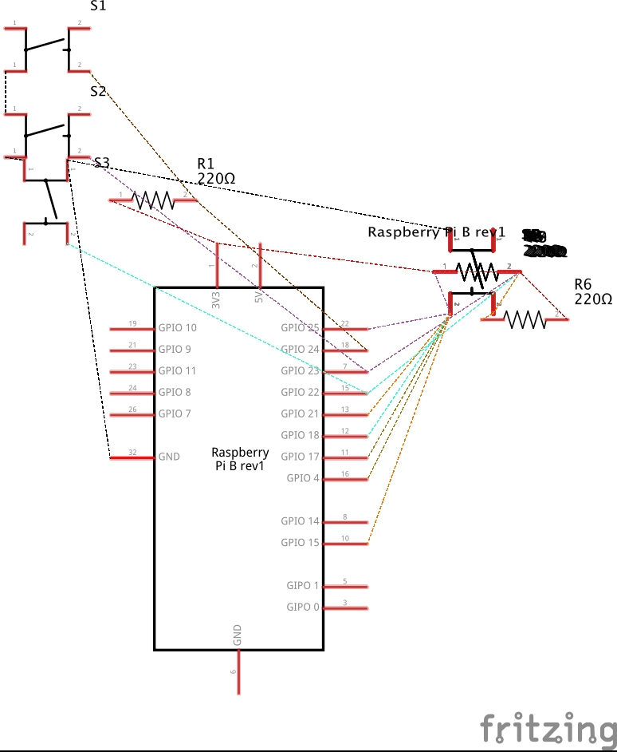

Technical Report
---------------

Project URL: https://github.com/katebell483/hw2_katebell483_multitap

Description: 
I chose to implement a multitap text entry technique. I chose this technique because of it’s ubiquity. Already having a sense for how this kind of device should look and function, I wanted to see if I could design my device in such a way that would have that natural feel. Even though multitap is a relatively straightforward choice, when it doesn’t work quite right it turns quickly into a poor user experience by disappointing expectations.   

The code was implemented using two java handlers-- one to keep letter state and the other minimized any signal bouncing effects. With each high button event the handler would trigger a callback function to post the corresponding letter . If the same button was pressed again during the 500ms delay the code would remove the queued callback event and issue another, while also incrementing a counter which identified the correct letter to post. Three pushes in quick succession, for example, will result in the third letter on the button. If another button is pushed the counter is reset and the process begins again. The second handler simply stops the code from executing twice in a very short timespan and acts as a debouncing mechanism.

The physical device is a simple laser cut wood box surrounding a breadboard. I soldered wires to each of the switches so that I was able to elevate them above the box, which contained holes for the wires to reach the breadboard. I then used the laser cutter again to create descriptive button covers and glued them to the original buttons. 

Reflection:
I found the difficulty level of the assignment to be about what I expected and appropriate for the course. I would say the most challenging aspect of the work was constructing the physical device. Though the code was relatively straightforward to write, getting it to play nicely with the device design was difficult.  Learning to solder was key. Managing the wires and designing the circuit also offered an interesting challenge. I have little experience with electronics and this was a great introduction. Ultimately, I left the project filled with ideas of how I want to do things differently the next time around and feeling empowered and knowledgeable enough to begin to refine my design choices.
 
Images:
 
 
 
 

Video Url: https://drive.google.com/file/d/0BzGShwtCuotcQTQyM3lEV1ZYY3c/view?usp=sharing (also Posted to BCourses)

License
-------

Copyright 2016 The Android Open Source Project, Inc.

Licensed to the Apache Software Foundation (ASF) under one or more contributor
license agreements.  See the NOTICE file distributed with this work for
additional information regarding copyright ownership.  The ASF licenses this
file to you under the Apache License, Version 2.0 (the "License"); you may not
use this file except in compliance with the License.  You may obtain a copy of
the License at

  http://www.apache.org/licenses/LICENSE-2.0

Unless required by applicable law or agreed to in writing, software
distributed under the License is distributed on an "AS IS" BASIS, WITHOUT
WARRANTIES OR CONDITIONS OF ANY KIND, either express or implied.  See the
License for the specific language governing permissions and limitations under
the License.
